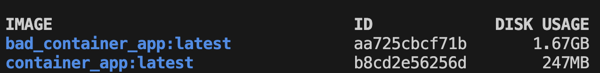

# lab1:

## Измерение размеров двух образов



## Как билдить

Запускаем все команды из корневой папки проекта.

Команда для хорошего докерфайла:
```
docker build -t container_app -f good_Dockerfile .
```

Команда для плохого докерфайла:
```
docker build -t bad_container_app -f bad_Dockerfile .
```

## Как запускать
Команда для хорошего докерфайла (порт 8081 на хосте взят как пример, можете поставить свой):
```
docker run -v ./data/:/app/data -p 8081:5000 container_app
```

Команда для плохого докерфайла:
```
docker run -v ./data/:/app/data -p 8081:5000 bad_container_app
```

## Плохие практики в bad.dockerfile

1. **Использование latest тега**  
   - Проблема: latest тег часто обновляется, может много весить и могут возникнуть конфликты зависимостей
   - Исправление: использование конретного python:3.12-slim образа

2. **Неэффективное использование слоев Docker**  
   - Проблема: каждая команда RUN создает новый слой -> несколько команд RUN увеличивают размер образа
   - Исправление: объединение команд в один RUN

3. **Установка пакетов после копирования файлов проекта**  
   - Проблема: если какой-то файл в проекте изменится, то докер будет устанавливать все зависимости из requirements.txt заново
   - Исправление: Сначала копируем только файл requirements.txt и перемещаем команды по установке пакетов наверх

4. **Копирование всей директории без .dockerignore**  
   - Проблема: COPY . /app копирует все файлы из директории (включая мусор, если он есть)
   - Исправление: копирование только нужных файлов и/или использование .dockerignore

5. **Нет очистки кэша пакетов**  
   - Проблема: pip3 install оставляет кэш, увеличивая размер образа
   - Исправление: pip install --no-cache-dir предотвращает сохранение кэша

6. **Запуск от root пользователя**  
   - Проблема: приложение запускается с правами root, что является уязвимостью безопасности
   - Исправление: создание отдельного пользователя с ограниченными правами

7. **Пишем переменную окружения прям в докерфайле**
   - Проблема: Пишем значение sensible переменной (апи ключ) внутри докерфайла
   - Исправление: переносим в .env и не коммитим этот файл в репозиторий

8. **Некорректное использование команды CMD**
   - Проблема: Скрипт и аргументы к нему перечислены в одной команде CMD
   - Исправление: Следуем [Best Practices](https://docs.docker.com/build/building/best-practices/#entrypoint) от Докера и делим на 2 команды - ENTRYPOINT для запуска скрипта и CMD для передачи аргументов


## Когда не стоит использовать контейнеры

1. **Слишком простой проект/просто скрипты**  
   - добавляет накладные расходы по управлению docker-ом

2. **Другая операционная система/ядро**  
   - контейнеры Docker используют ядро хост-системы