# lab3

## 1. Установка minikube
1. Предварительно установим Docker Desktop
   
2. Скачаем kubectl и minikube-installer
3. Запустим minikube командой minikube start
   
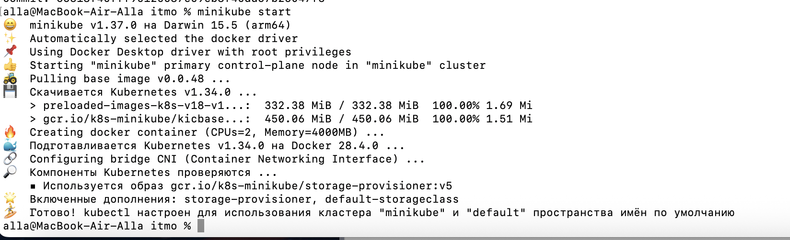

5. Проверим наличие контейнера minikube
   
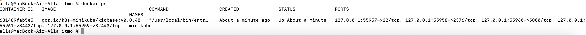

5. Посмотрим конфиг кластера
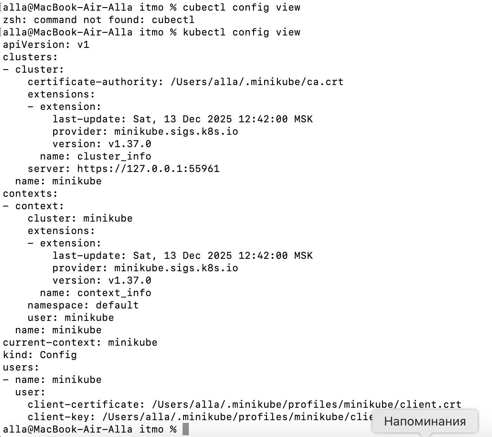


## 2. Создаем объекты через CLI
1. Порогоним манифесты для создания объектов в кластере
   
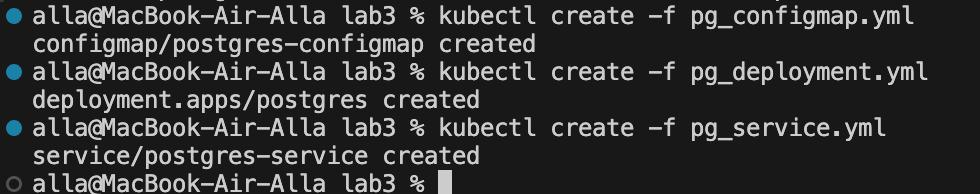

2. Проверим, что все сервисы создались

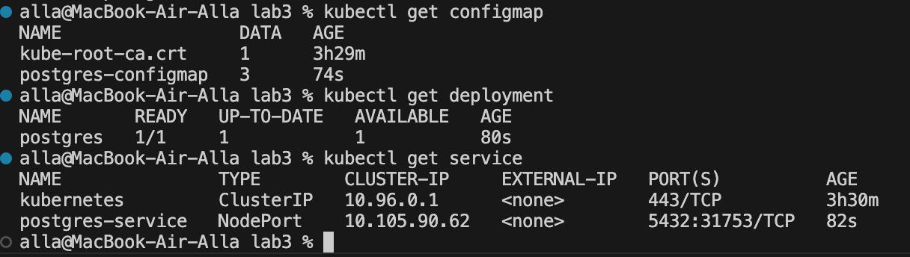

3. Создадим nextcloud

Содержимое секрета скрыто

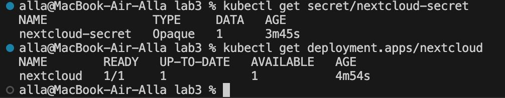

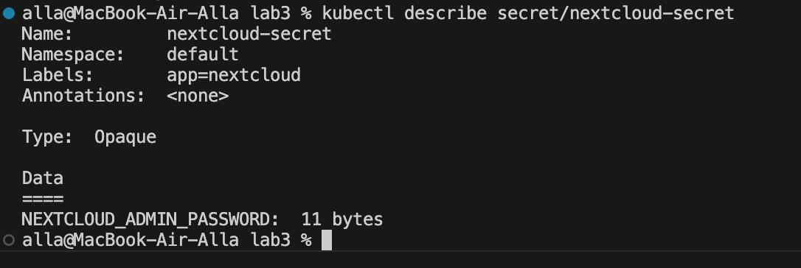

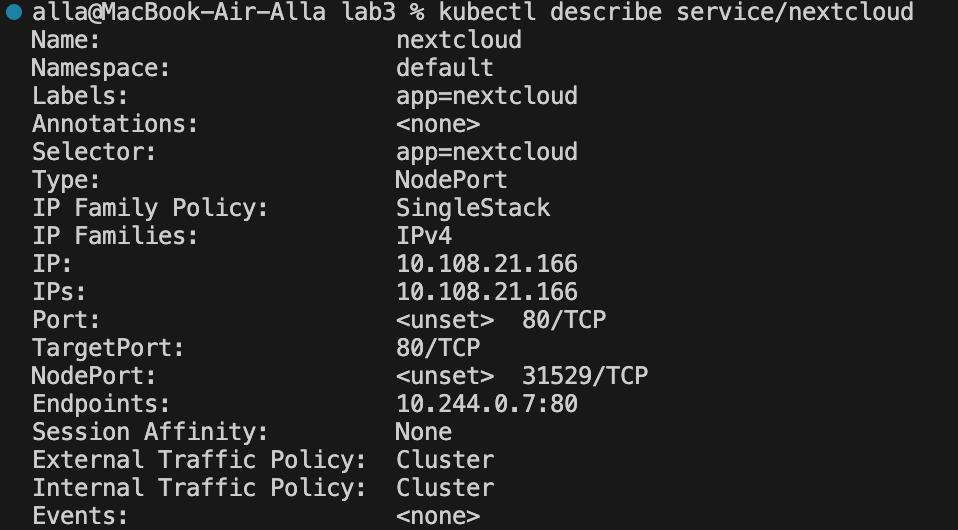

4. Посмотрим поды и логи
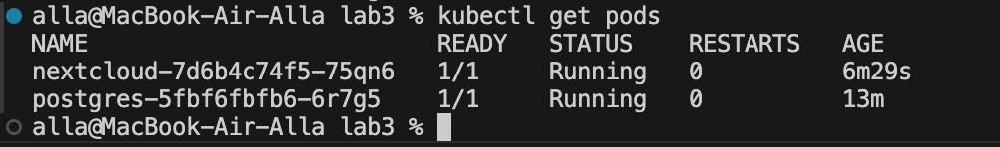

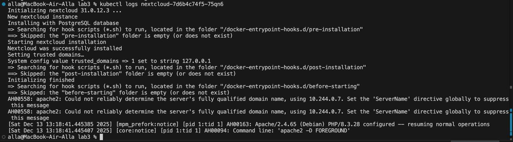

## 3. Подключаемся извне
1. Создадим сервис специальной командой и осуществим туннелирование трафика между нодой minikube и сервисом

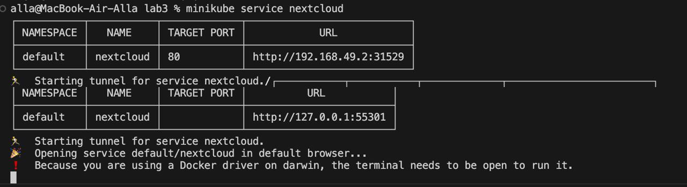

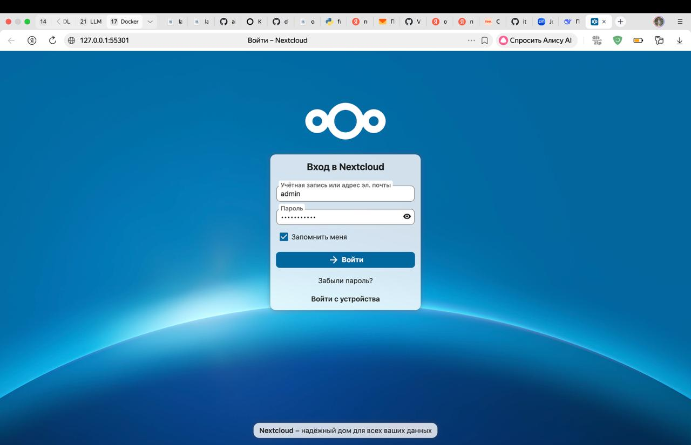

2. Установим допкомпонент dashboard для minikube

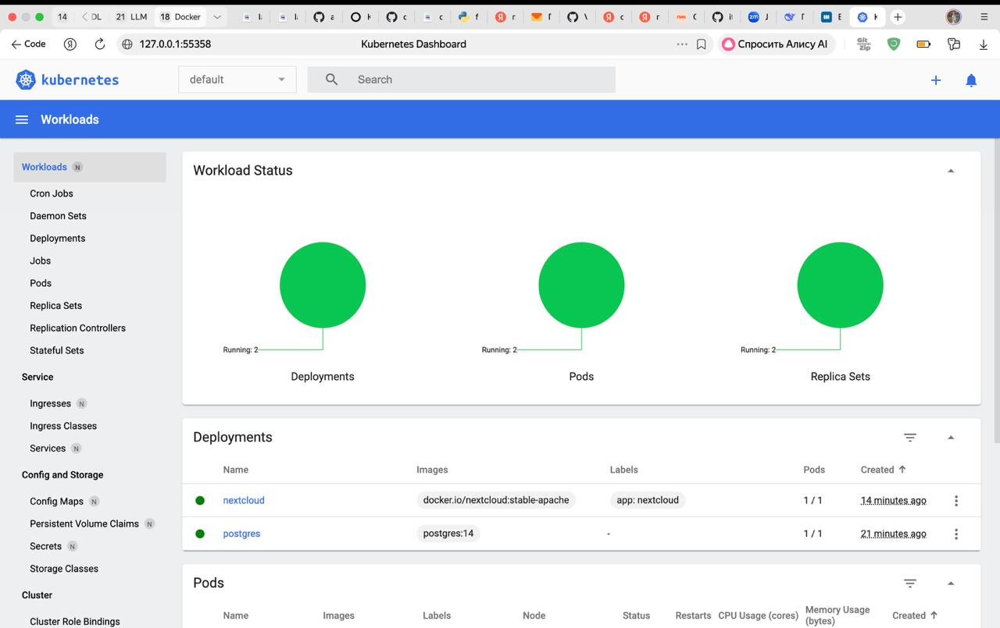

## 4. Модифицируем исходные манифесты
1. Создадим манифест ```pg_secret.yml``` и перенесем туда значения POSTGRES_USER и POSTGRES_PASSWORD
```
apiVersion: v1
kind: Secret
metadata:
  name: postgres-secret
  labels:
    app: postgres
type: Opaque
stringData:
  POSTGRES_USER: "postgres"
  POSTGRES_PASSWORD: "my_password"
```
2. Перенесем переменные nextcloud из деплоймента в конфигмап
```
apiVersion: v1
kind: ConfigMap
metadata:
  name: nextcloud-configmap
  labels:
    app: nextcloud
data:
  NEXTCLOUD_UPDATE: '1'
  ALLOW_EMPTY_PASSWORD: 'yes'
  POSTGRES_HOST: postgres-service
  NEXTCLOUD_TRUSTED_DOMAINS: "127.0.0.1"
  NEXTCLOUD_ADMIN_USER: "admin"
```

3. Добавим Liveness и Readiness пробы
```
        livenessProbe:
          httpGet:
            path: /status.php
            port: 80
            httpHeaders:
            - name: Host
              value: localhost
          initialDelaySeconds: 120
          periodSeconds: 10
          timeoutSeconds: 5
          failureThreshold: 3
        readinessProbe:
          httpGet:
            path: /status.php
            port: 80
            httpHeaders:
            - name: Host
              value: localhost
          initialDelaySeconds: 30
          periodSeconds: 5
          timeoutSeconds: 3
          failureThreshold: 3
```


## Ответы на вопросы

1. Важен ли порядок выполнения манифестов kubernetes? Почему?
   
Да, порядок выполнения манифестов Kubernetes важен, но Kubernetes сам управляет некоторыми аспектами зависимостей. В нашем примере Deployment nextcloud имеет значения, описанные в ConfigMap и Secret манифестов pg_configmap.yml, pg_secret.yml.

2. Что (и почему) произойдет, если отскейлить количество реплик postgres-deployment в 0, затем обратно в 1, после чего попробовать снова зайти на Nextcloud?

Nextcloud перестанет работать и данные могут быть потеряны, потому что PostgreSQL - stateful приложение, а не stateless.
